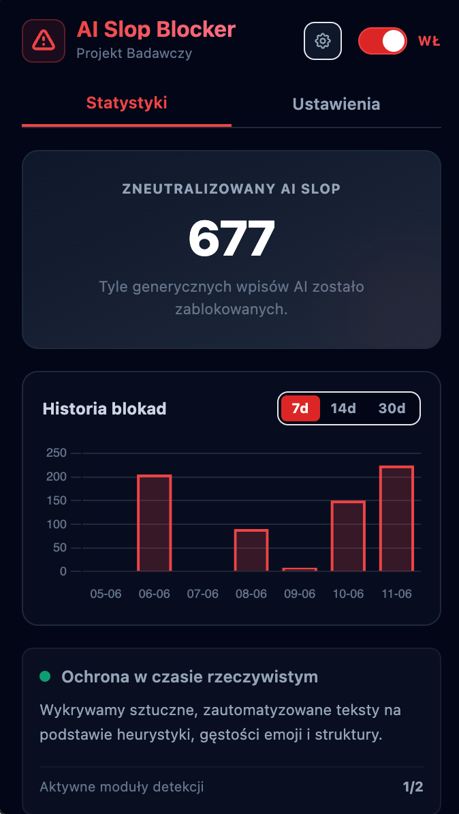
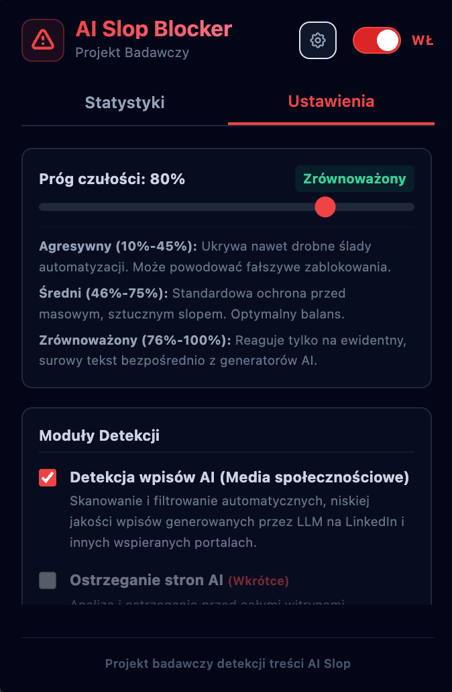
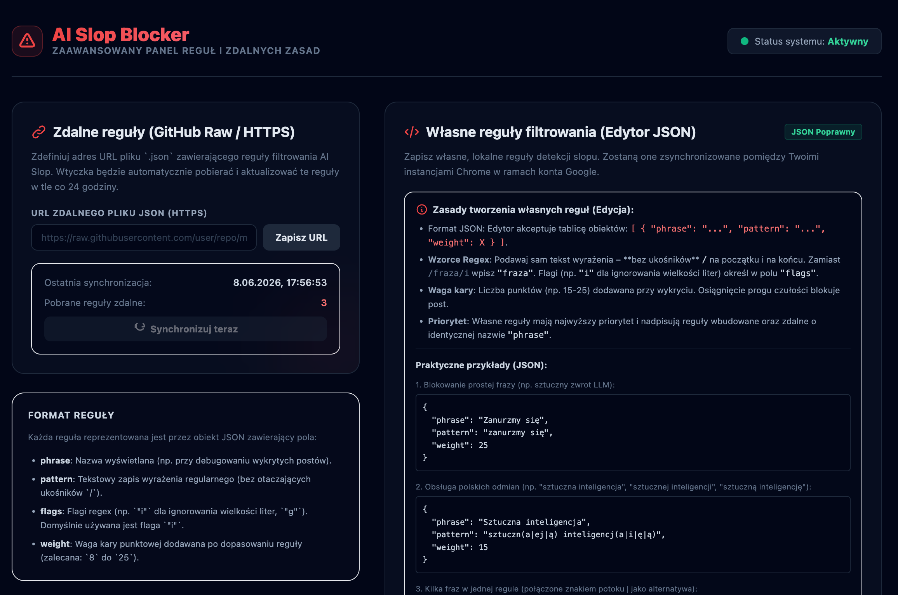
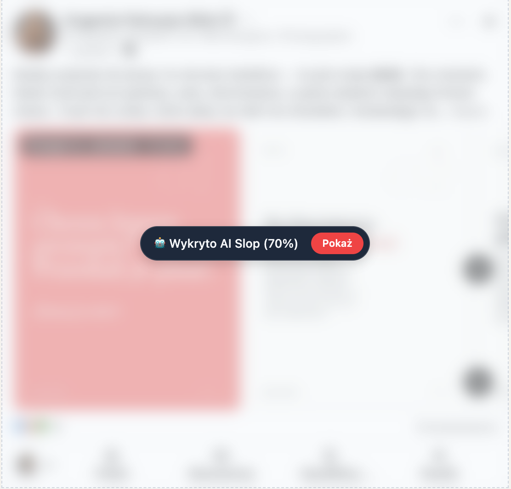

# AI Slop Blocker

Wtyczka do przeglądarki Google Chrome, która automatycznie wykrywa i blokuje niskiej jakości treści generowane przez sztuczną inteligencję (tzw. *AI Slop*) na stronach internetowych i portalach społecznościowych. 

Projekt opiera się na wydajnej analizie tekstu w locie oraz dynamicznym nakładaniu estetycznych nakładek maskujących z opcją natychmiastowego odsłonięcia zablokowanej zawartości.

---

## 📌 Spis Treści

* [💡 Dlaczego to powstało?](#-dlaczego-to-powstało)
* [📸 Wizualny Interfejs (Zrzuty Ekranu)](#-wizualny-interfejs-zrzuty-ekranu)
* [🚀 Główne Funkcje](#-główne-funkcje)
* [📂 Struktura Projektu](#-struktura-projektu)
* [🛠️ Instalacja i Uruchomienie](#%EF%B8%8F-instalacja-i-uruchomienie)
  * [Opcja A: Instalacja z gotowej paczki ZIP (Dla Użytkowników i Testerów)](#opcja-a-instalacja-z-gotowej-paczki-zip-dla-użytkowników-i-testerów)
  * [Opcja B: Budowanie ze źródeł (Dla Deweloperów)](#opcja-b-budowanie-ze-źródeł-dla-deweloperów)
* [🧰 Użyte Technologie](#-użyte-technologie)
* [🚀 Rozwój projektu i plany na przyszłość](#-rozwój-projektu-i-plany-na-przyszłość)
* [💡 Jak możesz wpłynąć na rozwój?](#-jak-możesz-wpłynąć-na-rozwój)

---


## 💡 Dlaczego to powstało?

Większość treści, na które natykamy się każdego dnia w mediach społecznościowych czy portalach informacyjnych, nie jest owocem ludzkiego doświadczenia, przemyśleń czy wiedzy – jest wynikiem "produkcji masowej" za pomocą generatorów AI. Ten fenomen, nazywany przez społeczność techniczną jako **AI Slop** (niskiej jakości, powtarzalny szum generatywny), tworzy barierę między ludźmi, zaśmieca dyskusje i sprawia, że docieranie do autentycznych treści staje się coraz trudniejsze.

AI Slop Blocker nie powstał przeciwko samej technologii AI, lecz przeciwko jej nadużywaniu w celu sztucznego zawłaszczania naszej uwagi. Naszą misją jest:

* **Przywrócenie kontroli użytkownikowi**: Wierzymy, że to Ty powinieneś decydować, co czytasz, a nie algorytmy promujące treści wygenerowane bezrefleksyjnie przez maszyny.
* **Oczyszczenie przestrzeni komunikacji**: Rozmywamy to, co sztuczne, aby uwydatnić to, co autentyczne. Nasze narzędzie działa w tle, przypominając Ci o tym, że pod "idealnie wygładzonymi" postami często nie ma drugiego człowieka.
* **Wspieranie autentyczności**: Dzięki systemowi białej listy autorów, dajemy narzędzie do promowania osób, które wkładają w swoją twórczość prawdziwy wysiłek i unikalną perspektywę.

Nie jesteśmy "blokadą internetu". Jesteśmy filtrem autentyczności, który pomaga oddzielić wartościowy przekaz od masowego, zautomatyzowanego szumu.

---

## 📸 Wizualny Interfejs (Zrzuty Ekranu)

Wtyczka posiada nowoczesny i estetyczny interfejs w trybie ciemnym (Dark Mode), zoptymalizowany pod kątem wygody użytkowania i czytelności.

### 1. Panel Główny (Popup) – Statystyki


Zakładka **Statystyki** dostarcza użytkownikowi najważniejszych danych o aktywności wtyczki w czasie rzeczywistym oraz umożliwia zarządzanie bazą badawczą:
* **Główny licznik zneutralizowanego slopu**: Wyświetla sumaryczną liczbę zablokowanych, automatycznie wygenerowanych postów.
* **Historia blokad**: Interaktywny wykres słupkowy prezentujący dynamikę blokowania w czasie (z możliwością filtrowania zakresów: 7 dni, 14 dni oraz 30 dni).
* **Ochrona w czasie rzeczywistym**: Status działania silnika analizującego oraz liczba aktywnych modułów detekcji (np. 1 z 2 aktywnych).
* **Baza badawcza (Telemetria)**: Sekcja prezentująca status telemetrii (Opt-in) oraz liczbę lokalnie zgromadzonych zdarzeń (zanonimizowane statystyki lingwistyczne, bez danych osobowych i treści postów).
* **Eksport danych badawczych**: Przyciski do pobrania bazy w formacie **JSON** lub **CSV** oraz opcja czyszczenia bazy ("Wyczyść bazę badawczą").
* **Reset statystyk**: Przycisk pozwalający na wyzerowanie głównych statystyk wtyczki (aktywny, gdy licznik blokad jest większy od zera).

### 2. Panel Główny (Popup) – Ustawienia Podstawowe


Zakładka **Ustawienia** umożliwia szybkie dostosowanie działania filtrów bezpośrednio z popupu wtyczki:
* **Próg czułości (Suwak)**: Pozwala na płynne ustawienie czułości detekcji AI. Poniżej suwaka znajdują się opisy zróżnicowanych poziomów tolerancji:
  * *Agresywny (10% - 45%)* – ukrywa nawet drobne ślady automatyzacji (może powodować fałszywe zablokowania).
  * *Średni (46% - 75%)* – standardowa ochrona przed masowym, sztucznym slopem (optymalny balans).
  * *Zrównoważony (76% - 100%)* – reaguje tylko na ewidentny, surowy tekst bezpośrednio z generatorów AI.
* **Moduły Detekcji**: Przełączniki umożliwiające aktywację lub dezaktywację poszczególnych modułów (detekcji wpisów w mediach społecznościowych oraz zapowiadanego ostrzegania przed całymi stronami AI).
* **Automatyczne odświeżanie stron SPA (CSR)**: Przełącznik dla trybu Single Page Applications. Gdy opcja jest włączona, wtyczka automatycznie odświeży stronę w przypadku wykrycia problemów z doczytaniem dynamicznej treści po przejściu na nową podstronę.
* **Całkowite ukrywanie postów AI Slop**: Eksperymentalna funkcja całkowitego usuwania elementów DOM wykrytych postów ze strony (zamiast standardowego rozmycia blurem z przyciskiem "Pokaż").
* **Wspieraj projekt badawczy (Telemetria)**: Przełącznik zgody na lokalne zbieranie statystyk w celu ulepszania bazy reguł.
* **Zaufani Autorzy (Biała lista)**: Narzędzie do wykluczania twórców z analizy. Obsługuje dodawanie **nazw wyświetlanych** (np. *Jan Kowalski*) oraz **fragmentów profilów URL** (np. `/in/jan-kowalski`).
* **Zaufane Strony (Domeny)**: Pole tekstowe do wykluczania całych domen z działania wtyczki (np. `messenger.com`).
* **Dedykowany przycisk opcji**: Uruchamia zaawansowany panel reguł w nowej karcie.

### 3. Zaawansowane Opcje (Options Page) – Zarządzanie Regułami


Strona konfiguracji otwiera się w nowej karcie po kliknięciu ikony zębatki w popupie. Pozwala na pełne zarządzanie regułami:
* **Zdalne reguły (GitHub Raw / HTTPS)**: Umożliwia zdefiniowanie adresu URL do zewnętrznego pliku JSON z regułami. Sekcja pokazuje status ostatniej synchronizacji, liczbę pobranych reguł oraz oferuje opcję natychmiastowego wymuszenia aktualizacji.
* **Formularz dodawania reguł**: Interaktywny panel na samej górze strony, który pozwala dodawać reguły pojedynczo (wprowadzając opis, wzorzec Regex, flagi oraz wagę).
* **Tabela reguł własnych (Custom Detection Rules)**: Lista dodanych reguł własnych z możliwością ich natychmiastowego usuwania za pomocą ikon kosza.
* **Własne reguły filtrowania (Edytor JSON)**: Wbudowany edytor kodu z walidacją poprawności składni JSON na żywo. Pozwala na szybki masowy import i eksport reguł w postaci tablicy obiektów.

### 4. Działanie Wtyczki w Praktyce (Wykrycie Slopu)


Rzeczywiste zachowanie wtyczki na stronie portalu społecznościowego w momencie wykrycia wpisu wygenerowanego przez AI:
* **Rozmycie (Blur)**: Cały post (wraz ze zdjęciem i tekstem) zostaje rozmyty, uniemożliwiając rozproszenie uwagi użytkownika.
* **Badge ostrzegawczy**: Na środku elementu wyświetla się dyskretna, ciemna plakietka z ikoną robota, informacją o wykryciu AI Slopu oraz wyliczonym prawdopodobieństwem (np. 70%).
* **Przycisk "Pokaż"**: Umożliwia natychmiastowe odsłonięcie zablokowanej treści w razie chęci jej przeczytania.

---

## 🚀 Główne Funkcje

* **Automatyczne blokowanie AI Slop**: Czyste wizualnie maskowanie postów ze wskaźnikiem prawdopodobieństwa wygenerowania przez AI.
* **Elastyczne zarządzanie**: Możliwość tymczasowego odsłonięcia zablokowanej treści jednym kliknięciem.
* **Zaawansowany system reguł**: Trójpoziomowe łączenie wzorców detekcji:
  1. *Własne (Custom)* – dodawane przez użytkownika w opcjach.
  2. *Zdalne (Remote)* – pobierane dynamicznie z zewnętrznego repozytorium JSON przez bezpieczne połączenie HTTPS.
  3. *Wbudowane (Built-in)* – zdefiniowane w kodzie wtyczki.
* **Biała lista autorów**: Funkcja wykluczania zaufanych twórców z analizy i oznaczania ich profilów zieloną plakietką wiarygodności (`asb-whitelist-badge`).
* **Wsparcie dla SPA**: Obsługa dynamicznej zmiany podstron bez przeładowania (Single Page Applications na popularnych portalach).

---

## 📂 Struktura Projektu

Repozytorium podzielone jest na następujące obszary:

* **[ai-slop-blocker/](ai-slop-blocker/)**: Kod źródłowy wtyczki (React, TypeScript, TailwindCSS, Vite).
* **[docs/](docs/)**: Zestaw profesjonalnej dokumentacji projektu:
  * **[docs/ARCHITECTURE.md](docs/ARCHITECTURE.md)** – opis wzorca `ModuleOrchestrator`, rejestracji modułów, MutationObservera oraz systemu zdalnych reguł.
  * **[docs/DEVELOPER_GUIDE.md](docs/DEVELOPER_GUIDE.md)** – instrukcja krok po kroku, jak stworzyć i zarejestrować nowy moduł detekcji (`ASBModule`).
  * **[docs/CONTRIBUTING.md](docs/CONTRIBUTING.md)** – przewodnik dla testerów (tryb debugowania w konsoli, znaczniki HTML w DOM, zgłaszanie błędów przez formularze Google Forms).

---

## 🛠️ Instalacja i Uruchomienie

### Opcja A: Instalacja z gotowej paczki ZIP (Dla Użytkowników i Testerów)

Jeśli chcesz po prostu zainstalować gotową wersję wtyczki bez konieczności kompilowania kodu ze źródeł:

1. Pobierz archiwum ZIP z najnowszej wersji wtyczki z sekcji **Releases** na GitHubie.
2. Otwórz przeglądarkę Google Chrome i wpisz w pasek adresu:
   ```text
   chrome://extensions/
   ```
3. Upewnij się, że masz włączony **Tryb dewelopera** (Developer mode) za pomocą przełącznika w prawym górnym rogu.
4. **Metoda przeciągnij-i-upuść (najszybsza)**:
   * Przeciągnij pobrany plik ZIP bezpośrednio na otwartą kartę `chrome://extensions/`. Rozszerzenie zostanie automatycznie zainstalowane.
5. **Alternatywna metoda ręczna**:
   * Rozpakuj pobrany plik ZIP w dowolnym, wybranym folderze na swoim dysku.
   * Na karcie `chrome://extensions/` kliknij przycisk **Załaduj rozpakowane** (Load unpacked) w lewym górnym rogu.
   * Wybierz rozpakowany folder (musi to być katalog zawierający plik `manifest.json`, np. wypakowany folder `dist`).

---

### Opcja B: Budowanie ze źródeł (Dla Deweloperów)

Jeśli planujesz rozwijać wtyczkę, modyfikować reguły lub testować zmiany na żywo:

#### Wymagania systemowe
* Node.js (wersja v18 lub nowsza)
* npm (wersja v9 lub nowsza)

#### Instrukcja Uruchomienia

1. Przejdź do katalogu projektu wtyczki:
   ```bash
   cd ai-slop-blocker
   ```

2. Zainstaluj wymagane zależności:
   ```bash
   npm install
   ```

3. Uruchom serwer deweloperski w trybie ciągłego budowania (HMR):
   ```bash
   npm run dev
   ```
   *Wtyczka zostanie automatycznie skompilowana do katalogu `dist/`.*

4. Załaduj wtyczkę do Chrome:
   - Otwórz w przeglądarce adres `chrome://extensions/`.
   - Włącz **Tryb dewelopera** w prawym górnym rogu.
   - Kliknij **Załaduj rozpakowane** (Load unpacked) i wskaż wygenerowany katalog `ai-slop-blocker/dist/`.

#### Przygotowanie paczki produkcyjnej (ZIP) do wydań

Jeśli chcesz wygenerować spakowane archiwum produkcyjne w celu dodania go do wydań w sekcji Releases na GitHubie, wykonaj polecenie:
```bash
npm run zip
```
*Spowoduje to skompilowanie kodu produkcyjnego i automatyczne utworzenie spakowanego archiwum ZIP (np. `ai-slop-blocker-v0.1.0.zip`) w głównym katalogu projektu.*

---

## 🧰 Użyte Technologie

* **Core**: React 19, TypeScript, Vite, TailwindCSS (stylizacja popup i opcji).
* **Content/Background Scripts**: Vanilla JS / TS, Chrome Extension API (storage.local, storage.sync).
* **DOM Scanning**: MutationObserver (reaktywna detekcja zmian w drzewie DOM).

---

## 🚀 Rozwój projektu i plany na przyszłość

AI Slop Blocker to projekt w fazie intensywnego rozwoju (Beta). Nasza architektura została zaprojektowana w oparciu o modułowy system orkiestracji, co pozwala na błyskawiczne dodawanie nowych form detekcji spamu bez konieczności przebudowy całego systemu.

### Aktualny status:
* **✅ Rdzeń (Orchestrator)**: Stabilny i zoptymalizowany pod kątem wydajności (niskie zużycie zasobów przy dużych zbiorach danych).
* **✅ Zarządzanie regułami**: Dynamiczny system pobierania reguł z GitHub Raw, pozwalający na aktualizację bazy detekcji bez konieczności aktualizacji samej wtyczki.
* **✅ Stabilność UI**: System "inteligentnego wstrzykiwania" (z flagowaniem DOM), zapewniający stabilność na dynamicznych stronach typu SPA (Single Page Applications).

### Harmonogram dalszych prac:
* **Ekspansja datasetu (Bieżące)**: Skupiamy się na zbieraniu sygnatur stron generowanych przez AI (strony typu Lovable/Framer/AI-builders). Każde Twoje zgłoszenie przez formularz trafia bezpośrednio do naszej bazy badawczej.
* **Moduł detekcji stron (Q3 2026)**: Implementacja dedykowanego modułu ostrzegającego przed całymi domenami, których struktura wskazuje na masową produkcję treści przy użyciu LLM.
* **Zaawansowana analityka użytkownika**: Planujemy wprowadzenie modułu statystyk lokalnych, który pozwoli Ci sprawdzić, ile czasu "odzyskałeś", blokując niskiej jakości treści w swoim feedzie.
* **Tryb społecznościowy**: Możliwość subskrybowania zewnętrznych list reguł od zaufanych twórców i ekspertów w dziedzinie higieny cyfrowej.

---

## 💡 Jak możesz wpłynąć na rozwój?

Twój feedback jest kluczowy dla rozwoju wtyczki i ciągłego doskonalenia algorytmów detekcji. Możesz wesprzeć projekt, korzystając z dedykowanych formularzy:

1. **[Zgłaszanie Błędów Detekcji / Heurystyki (False Positive & False Negative)](https://docs.google.com/forms/d/e/1FAIpQLSd5oBcQ3UEzO4GCCo4lynSBKpIT1kMiJPzOzAeluXHByPZFGw/viewform)**
   * Użyj tego formularza, gdy wtyczka zablokuje treść napisaną przez człowieka lub przepuści post wygenerowany przez AI.
2. **[Zgłaszanie Błędów Technicznych (Bug Report)](https://docs.google.com/forms/d/e/1FAIpQLSfvre6YNYjxYNt5jFiLeRNh5Kv8KywyElaoIkS2bdOkchTRPw/viewform)**
   * Zgłoś wszelkie błędy techniczne i wizualne w działaniu samej wtyczki (nakładki, popup, strona opcji).
3. **[Propozycje Nowych Reguł i Funkcji (Feature Request)](https://docs.google.com/forms/d/e/1FAIpQLSf3LoiaV9-xLHyiEOe0dr-IZL9U2o6IaGIfckOiq51NwNv6-g/viewform)**
   * Zaproponuj nowe słowa kluczowe, reguły Regex lub pomysły na nowe funkcje i moduły detekcji.
4. **[Ankieta Satysfakcji i Feedback UX](https://docs.google.com/forms/d/e/1FAIpQLSd7uLeWlOkAfkaXyhr_fRcaNTThS-3MUEnSWSJOee2bymbxgg/viewform)**
   * Podziel się swoimi ogólnymi wrażeniami, pomóż nam ulepszyć interfejs oraz dostroić czułość filtrów.

Możesz także otworzyć Issue bezpośrednio w naszym repozytorium GitHub. Wspólnie przywracamy jakość w sieci!

