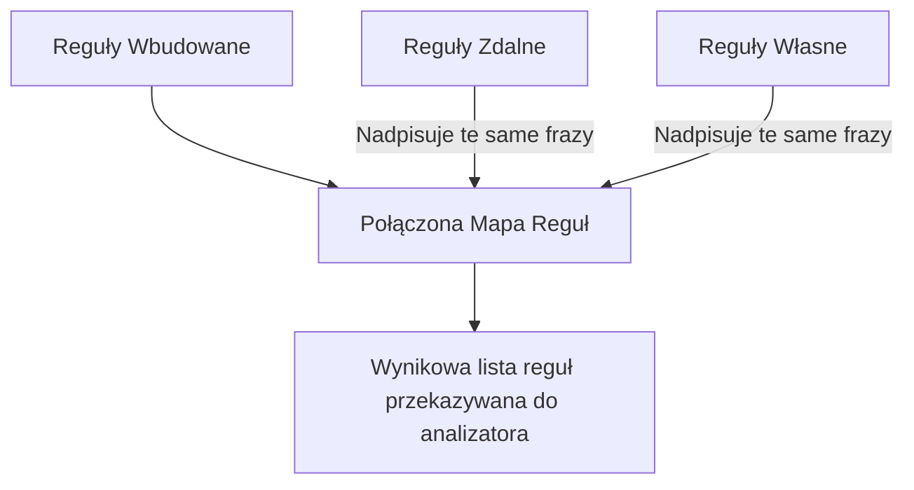

# Architektura Systemu - AI Slop Blocker

Ten dokument szczegółowo opisuje architekturę wtyczki **AI Slop Blocker**, w tym wzorce projektowe, rejestrację modułów, system łączenia reguł oraz mechanizm dynamicznego skanowania stron internetowych.

---

## 1. Wzorzec ModuleOrchestrator

Sercem wtyczki jest klasa `ModuleOrchestrator` zlokalizowana w pliku [orchestrator.ts](../ai-slop-blocker/src/core/orchestrator.ts). Odpowiada ona za zarządzanie cyklem życia wszystkich modułów detekcji oraz koordynowanie nasłuchiwania zdarzeń przeglądarkowych.

### Założenia projektowe i cechy:
* **Singleton**: `ModuleOrchestrator` jest zaimplementowany jako Singleton (`ModuleOrchestrator.getInstance()`), co gwarantuje istnienie tylko jednej instancji zarządzającej stanem wtyczki w obrębie danej karty.
* **Centralny MutationObserver**: Zamiast tworzenia osobnych obserwatorów DOM w każdym module, orkiestrator utrzymuje jeden wydajny `MutationObserver` nasłuchujący na zmiany struktury `document.body` (w tym `childList`, `characterData` oraz atrybutów takich jak `class`, `data-asb-blocked` i `data-slop-revealed`).
* **Koordynacja SPA (Single Page Applications)**: Orkiestrator przechwytuje zdarzenia nawigacji SPA (`hashchange`, `popstate` oraz niestandardowe zdarzenie `asb-spa-navigation`) i propaguje je do modułów w celu ponownej weryfikacji kontekstu strony.

### Schemat Inicjalizacji Orkiestratora

Poniższy diagram Mermaid przedstawia proces uruchamiania systemu przy załadowaniu strony:

```mermaid
sequenceDiagram
    autonumber
    participant Browser as Przeglądarka / DOM
    participant Orch as ModuleOrchestrator
    participant Rules as RemoteRules Manager
    participant Storage as Chrome Storage
    participant Module as ASBModule (np. posts)

    Browser->>Orch: start() (DOMContentLoaded)
    rect rgb(30, 30, 40)
        Note over Orch, Rules: Krok 1: Ładowanie reguł
        Orch->>Orch: loadAndCombineRules()
        Orch->>Storage: Pobierz reguły (wbudowane, zdalne, własne)
        Storage-->>Orch: Reguły JSON
        Orch->>Orch: Połącz i skompiluj Regex (priorytet: własne > zdalne > wbudowane)
    end
    
    rect rgb(40, 30, 30)
        Note over Orch, Storage: Krok 2: Ustawienia & Moduły
        Orch->>Storage: getSettings()
        Storage-->>Orch: PluginSettings
        Orch->>Orch: updateLocalSettings()
        loop Dla każdego zarejestrowanego modułu
            Orch->>Module: init() (jeśli zdefiniowane)
        end
    end

    rect rgb(30, 40, 30)
        Note over Orch, Browser: Krok 3: Nasłuchiwanie zmian
        Orch->>Browser: Rejestracja SPA listeners (popstate, hashchange)
        Orch->>Orch: setupSettingsListeners() (nasłuchiwanie zmian konfiguracji)
        Orch->>Browser: Uruchomienie centralnego MutationObservera
    end
```



---

## 2. Rejestracja i Cykl Życia Modułów

Wtyczka została zaprojektowana w sposób modułowy. Każdy moduł detekcji musi implementować interfejs `ASBModule` zdefiniowany w pliku [module.ts](../ai-slop-blocker/src/types/module.ts).

### Interfejs `ASBModule`

```typescript
export interface ASBModule {
  id: string;                         // Unikalny identyfikator modułu
  name: string;                       // Nazwa wyświetlana modułu
  description?: string;               // Opcjonalny opis działania
  isEnabled: () => boolean;           // Sprawdza, czy moduł jest włączony w opcjach
  analyze: (node: Element) => void;   // Wywoływane dla każdego nowego/zmienionego elementu DOM
  
  // Opcjonalne metody cyklu życia modułu
  init?: () => Promise<void> | void;  // Wywoływane raz podczas startu wtyczki
  onUrlChange?: (url: string) => Promise<void> | void; // Wywoływane po wykryciu nawigacji (np. SPA)
  onSettingsChange?: (settings: PluginSettings) => Promise<void> | void; // Wywoływane po zmianie ustawień w storage
}
```

### Przepływ analizy węzłów w MutationObserver

Gdy MutationObserver wykryje modyfikacje w strukturze strony, orkiestrator filtruje węzły i przekazuje je do aktywnych modułów:

```mermaid
graph TD
    A[MutationObserver wykrywa zmianę] --> B{Czy wtyczka włączona i strona nie wykluczona?}
    B -- Nie --> C[Ignoruj zmianę]
    B -- Tak --> D[Wyodrębnij zmienione węzły ELEMENT_NODE i TEXT_NODE]
    D --> E[Dla każdego węzła: analyzeNodeInModules]
    E --> F[Iteracja po modułach z listy this.modules]
    F --> G{Czy moduł isEnabled()?}
    G -- Tak --> H[Wywołaj mod.analyzeNode]
    G -- Nie --> I[Pomiń moduł]
```

> [!NOTE]
> Moduł [posts.ts](../ai-slop-blocker/src/modules/posts.ts) korzysta z kolejkowania analizy (`pendingElements` i `requestAnimationFrame` / `setTimeout`), aby zminimalizować narzut wydajnościowy (deboucing) podczas masowego renderowania elementów (np. nieskończone przewijanie feedu na dynamicznych portalach społecznościowych).

---

## 3. System Zdalnych Reguł i Ich Priorytetyzacja

Wtyczka umożliwia dynamiczne aktualizowanie bazy zakazanych fraz i wzorców bez konieczności ponownej publikacji wtyczki w Chrome Web Store. Odpowiada za to system reguł zdefiniowany w [remoteRules.ts](../ai-slop-blocker/src/core/remoteRules.ts).

### Synchronizacja Reguł Zdalnych

Funkcja `fetchRemoteRules(url)` pobiera plik konfiguracyjny JSON. Wdrożono tu rygorystyczne mechanizmy bezpieczeństwa i stabilności:
1. **Wymóg HTTPS**: URL musi rozpoczynać się od protokołu `https://`. Żądania `http://` są odrzucane w celu zapobieżenia atakom typu MITM (Man-in-the-Middle).
2. **Walidacja struktury danych**: Sprawdzane jest, czy główny obiekt to tablica oraz czy każda reguła posiada poprawne pola: `phrase` (string), `pattern` (string), `weight` (number).
3. **Kompilacja testowa**: Zanim reguła zostanie zapisana, wtyczka próbuje skompilować wyrażenie regularne (`new RegExp(pattern, flags)`). Jeśli kompilacja się nie powiedzie, reguła jest odrzucana, co zapobiega awariom orkiestratora na etapie przetwarzania stron.
4. **Zapis i Znacznik Czasu**: Pomyślnie zwalidowane reguły trafiają do `chrome.storage.local`, a czas synchronizacji jest odnotowywany.

### 🔒 Bezpieczeństwo Zdalnych Reguł

Mechanizm dynamicznych reguł został zaprojektowany z myślą o maksymalnym bezpieczeństwie działania:
* **HTTPS jako warunek konieczny**: Wszystkie zdalne zapytania o reguły muszą być szyfrowane przy użyciu protokołu SSL/TLS. Wtyczka odrzuca adresy nieszyfrowane (`http://`), zapobiegając próbom wstrzyknięcia niebezpiecznych lub złośliwych wzorców przez osoby trzecie w sieci (ochrona przed atakami MITM).
* **Zaufane źródło**: Reguły są pobierane bezpośrednio z zaufanego, oficjalnego repozytorium projektu w postaci surowego pliku JSON (GitHub Raw). Zapewnia to pełną kontrolę i integralność nad zestawem reguł udostępnianych użytkownikom.
* **Walidacja i izolacja błędów**: Każda pobrana reguła podlega dokładnej weryfikacji. Uszkodzone lub niepoprawnie skompilowane wyrażenia regularne są natychmiast odrzucane i nie są rejestrowane przez orkiestrator, co eliminuje ryzyko awarii całej wtyczki na skutek błędu po stronie serwera reguł (crash-proof design).

### Łączenie i Nadpisywanie Reguł (Resolving Conflict)

W pliku [orchestrator.ts](../ai-slop-blocker/src/core/orchestrator.ts#L32) zaimplementowano metodę `loadAndCombineRules()`, która scala reguły z trzech źródeł według ustalonej hierarchii priorytetów:

| Źródło reguł | Opis | Priorytet | Przechowywanie |
| :--- | :--- | :--- | :--- |
| **Własne (Custom)** | Reguły dodane ręcznie przez użytkownika w opcjach wtyczki. | **Najwyższy (1)** | `chrome.storage.sync` |
| **Zdalne (Remote)** | Reguły pobrane z zewnętrznego serwera / repozytorium. | **Średni (2)** | `chrome.storage.local` |
| **Wbudowane (Built-in)** | Domyślna, zakodowana na stałe baza reguł wtyczki. | **Najniższy (3)** | Kod źródłowy (`analyzer.ts`) |



Dzięki zastosowaniu klucza mapy opartego na znormalizowanej (małymi literami) frazie (`phrase.toLowerCase()`), reguły o wyższym priorytecie bezkolizyjnie nadpisują wzorce i wagi zdefiniowane w źródłach o niższym priorytecie.
